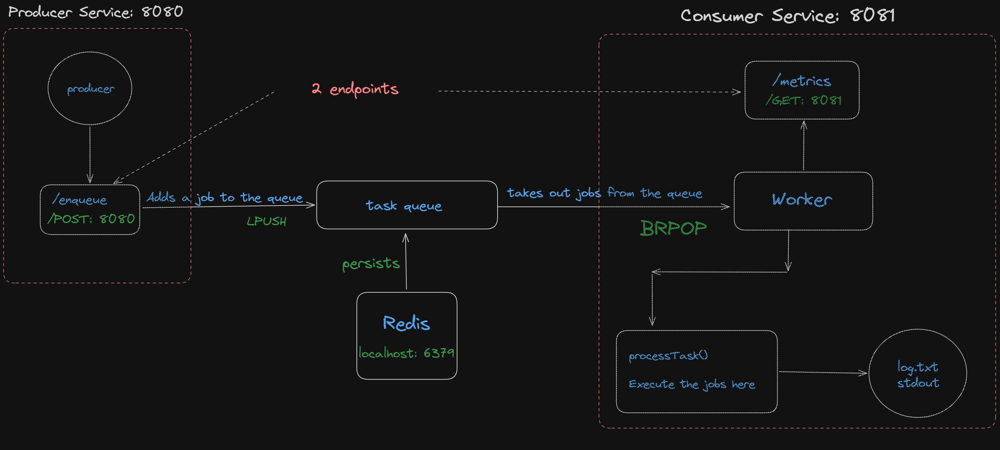

# TaskQueue

A robust, asynchronous distributed job queue system built with **Spring Boot**, **Redis**, and **Maven**.
This project demonstrates the decoupling of **task production and consumption** using a **Producer-Consumer architecture**, complete with automated fault tolerance and a Dead Letter Queue (DLQ) safety net.

## 🚀 High Level Overview



The system is fully containerized and consists of three main components:

* **Producer (Port 8080):** A Spring Boot REST API that receives tasks and pushes them into a Redis queue.
* **Message Broker (Redis):** Acts as the ultra-fast, in-memory orchestrator, storing the active `task_queue` and the `dead_letter_queue`.
* **Worker:** A background processor that pulls tasks from Redis using the `BRPOP` (Blocking Pop) strategy. It executes tasks, handles failures and retries, and securely routes poisoned messages to the DLQ.

## 🛠 Tech Stack

* **Java 21**
* **Spring Boot 3.x**
* **Redis** (Message Broker)
* **Jedis** (Redis Client)
* **Docker & Docker Compose** (Containerization & Orchestration)
* **Maven** (Multi-module structure)
* **Lombok**

## 🏗 Project Structure

* `common/`: Contains shared models like `Task` and `Metrics`.
* `producer/`: The API gateway for enqueuing jobs and managing the DLQ.
* `worker/`: The consumer that processes jobs, handles retries, and serves monitoring data.
* `docker-compose.yml`: Spins up the entire architecture (Redis, Producer, and Worker) in a single unified network.

## ⚙️ Key Features

* **Efficient Task Pulling:** Uses `BRPOP` to eliminate CPU wastage by waiting for tasks instead of constant polling.
* **Asynchronous Processing:** Worker processes tasks in a dedicated background thread, keeping the web server responsive.
* **Fault Tolerance & Retries:** If a task crashes, the worker intercepts the failure, decrements a retry counter, and re-queues it.
* **Dead Letter Queue (DLQ):** Tasks that exhaust their retry limit (default: 3) are safely routed to a separate DLQ to prevent data loss.
* **DLQ Management API:** Built-in endpoints to inspect failed messages and manually replay them back into the main queue.
* **Fully Containerized:** Zero manual setup required for the infrastructure.

## 🚦 How to Run the Project

Since the system is now fully containerized, you no longer need to start Redis or the applications manually!

### 1. Build the project
From the root directory, compile the "fat" executable JAR files:
```bash
  mvn clean install
```

### 2. Spin up the Architecture

Use Docker Compose to build the images and launch the Producer, Worker, and Redis broker simultaneously:

```bash
    docker compose up --build
```

## 🌐 API Reference & Testing

You can verify the system's fault tolerance using a "Chaos Demo." The worker is configured to simulate a crash if the target email contains the word `"fail"`.

Open your terminal and run this script to send 5 valid tasks and 5 poisoned tasks:

```bash
# 1. Send 5 Valid Tasks (Will Succeed)
    for i in {1..5}; do
        curl -s -X POST http://localhost:8080/enqueue \
        -H "Content-Type: application/json" \
        -d "{\"type\": \"send_email\", \"retries\": 3, \"payload\": {\"to\": \"success$i@example.com\"}}"
    done

# 2. Send 5 Poisoned Tasks (Will Crash -> Retry -> DLQ)
    for i in {1..5}; do
        curl -s -X POST http://localhost:8080/enqueue \
        -H "Content-Type: application/json" \
        -d "{\"type\": \"send_email\", \"retries\": 3, \"payload\": {\"to\": \"fail$i@example.com\"}}"
    done
```


## Managing the DLQ
* **View Failed Tasks:** `GET http://localhost:8080/dlq`
  *(Returns a JSON array of tasks that exhausted their retries).*
* **Replay Failed Tasks:** `POST http://localhost:8080/dlq/replay`
  *(Resets the retry counter to 3 and pushes DLQ tasks back to the main queue).*

## 📊 Metrics Explained

Open your browser and visit: `http://localhost:8081/metrics` (if exposed) or view the logs to track:

* **total_jobs_in_queue:** Number of tasks currently waiting in Redis.
* **jobs_done:** Successfully processed tasks.
* **jobs_failed:** Tasks that encountered errors during execution.


## ➕ Additional Features
**Efficient Resource Management (Blocking I/O):**

The project implements the BRPOP (Blocking Pop) command instead 
of traditional polling. This means the Worker thread "sleeps" and
consumes zero CPU cycles while the queue is empty, instantly 
waking up only when a new task arrives.

**Multi-Threaded Monitoring (Non-Blocking):**

By using a dedicated background thread for task processing, 
the Worker's server remains free and responsive. You can check 
your /metrics dashboard even while the Worker is busy processing 
a long-running task.

Created by Aditya